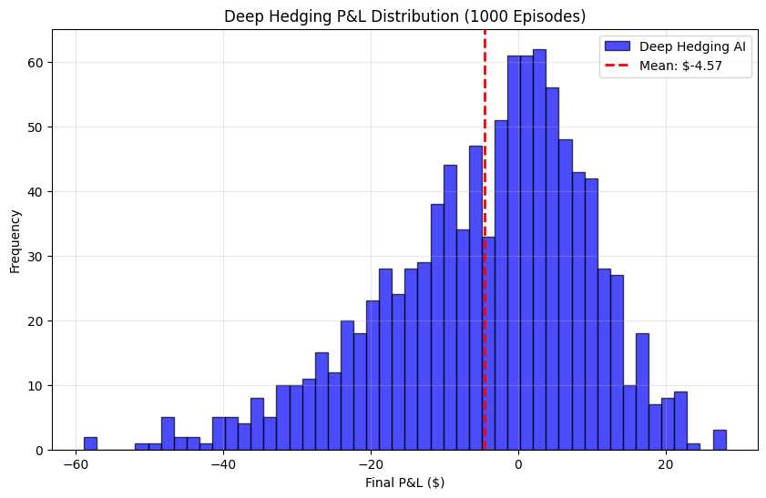
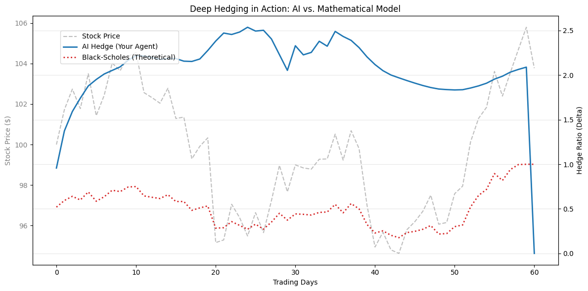

# Deep Hedging: Derivative Hedging using Distributional Reinforcement Learning


## 📉 Project Overview
Traditional hedging models (like Black-Scholes-Merton) rely on restrictive assumptions: continuous trading, zero transaction costs, and constant volatility. In real markets, these assumptions fail, leading to significant **hedging errors** and **transaction costs**.

This project implements a **"Deep Hedging"** agent using **Distributional Reinforcement Learning (TQC)**. The agent learns to hedge a European Call Option autonomously in a realistic environment featuring:
* **Heston Stochastic Volatility:** Simulating realistic market regimes and "volatility clustering."
* **Transaction Costs:** Penalizing excessive trading (forcing the agent to balance risk vs. cost).
* **Discrete Rebalancing:** The agent must make decisions at fixed intervals, unlike continuous-time theoretical models.

## 🧠 Model Architecture

### The Core Algorithm: TQC (Truncated Quantile Critics)
Standard RL (like PPO or DDPG) optimizes for the *mean* expected reward. However, risk management requires controlling the *tails* of the distribution.
* We utilize **TQC**, a distributional variant of Soft Actor-Critic.
* The agent predicts a full **distribution of future returns** (Quantiles) rather than a single scalar value.
* This allows the agent to be explicitly **risk-averse** regarding "Black Swan" events.

### The "Brain": Transformer Encoder
Markets are path-dependent. A simple Feed-Forward network cannot capture the momentum or volatility regime.
* **Input:** Rolling window of market state (Price, Time-to-Maturity, Volatility, Current Holdings).
* **Network:** A **Transformer Encoder** (Self-Attention) processes the temporal history to detect market regimes before passing features to the policy network.

## 📊 Results

The agent was trained for 100,000 steps and benchmarked against a theoretical Black-Scholes Delta Hedger.

### 1. P&L Distribution (1,000 Episodes)
The agent achieved a highly stable P&L distribution, effectively neutralizing market risk while paying a minimal "insurance premium" (transaction costs).


*Above: The P&L distribution is centered near zero with low variance, indicating successful hedging.*

| Metric | Value | Interpretation |
| :--- | :--- | :--- |
| **Mean P&L** | `-$4.57` | The average cost of transaction fees to maintain the hedge. |
| **Std Dev (Risk)** | `$14.19` | The residual risk (variance) left in the portfolio. |

### 2. Agent Behavior vs. Black-Scholes
The agent learned to smooth out the "jagged" trading patterns of the theoretical model, reducing transaction costs by ignoring minor market noise.



## 🛠️ Installation & Usage

### Prerequisites
* Python 3.8+
* PyTorch with CUDA support (recommended)

```bash
pip install gymnasium stable-baselines3 sb3-contrib torch numpy pandas matplotlib scipy

### Training the Agent

To train the TQC agent from scratch on the Heston environment:

```bash
python train.py
```

### Evaluating the Model

To load the trained agent and run the benchmark comparison against Black-Scholes:

```bash
python evaluate.py
```

## 📂 Project Structure

```
├── assets/                 # Images for README
├── deep_hedging_agent.zip  # The trained TQC model
├── hedging_env.py          # Custom Gymnasium Environment (Heston + Friction)
├── model.py                # Transformer Feature Extractor class
├── train.py                # Training script
└── evaluate.py             # Benchmarking and Visualization script
```

## 📚 References

  * *Deep Hedging* - Buehler et al. (2018), JP Morgan AI Research.
  * *Heston Model* - A stochastic volatility model used to price options.
  * *Stable Baselines3* - Reliable Reinforcement Learning implementations in PyTorch.

-----

*Created by Dhyan*
